# Hi, I'm Giancarlo

Software and Data Engineer with 12+ years of experience building scalable data platforms, cloud architectures, and ML-enabled solutions.

I work mainly with AWS, Databricks, PySpark, Python, MLflow, and modern data engineering stacks. I'm currently focused on production ML, LLM applications, semantic search, and scalable data pipelines.

## What I work with

- Data Engineering: Spark, PySpark, Databricks, Delta Lake, Airflow
- Cloud: AWS, Glue, EMR, Lambda, S3, Athena, Redshift
- ML / AI: XGBoost, scikit-learn, MLflow, LLMs, RAG, embeddings
- Backend: Python, APIs, microservices, serverless architectures

## Current interests

- Production ML and MLOps
- LLM-powered systems
- Semantic search and recommendation systems
- Cloud-native data platforms

